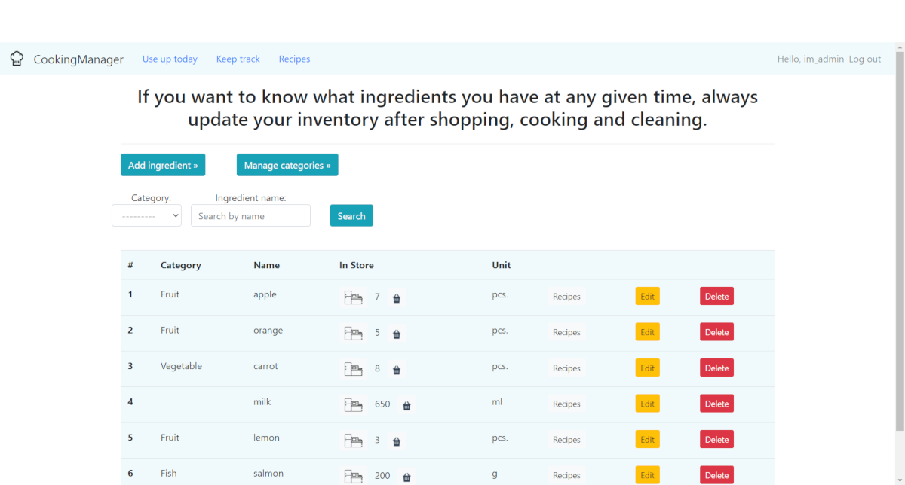
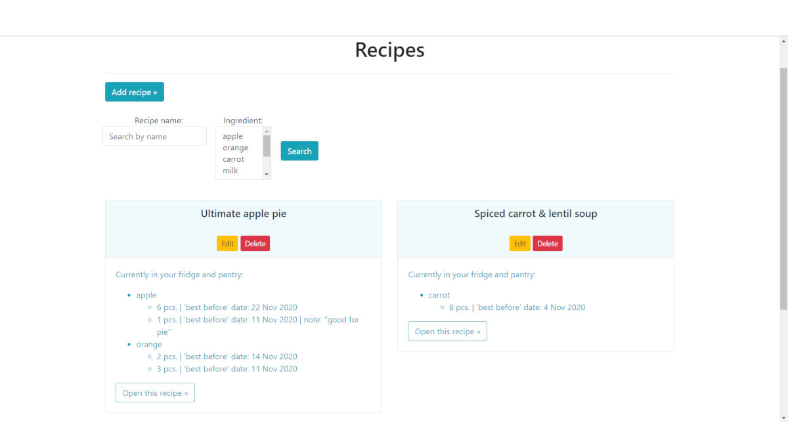

# Cooking Manager - django website
> This is a simple app to keep track your pantry and fridge inventory and store your favorite recipes.
## Table of contents
* [Motivation](#motivation)
* [Screenshots](#screenshots)
* [Technologies](#technologies)
* [Setup](#setup)
* [Features](#features)

## Motivation
This django project is created to improve my django development skills.

## Screenshots

## Technologies
* Django - version 3.1.3
* Bootstrap 4

## Setup
* Run the command `git clone https://github.com/KasiaCzy/ingredients_manager.git` to have this repository locally in your computer
* Change into the new directory
* Run the command `python manage.py runserver` to run the app on a local server
* Open your web browser and enter the address of your local server (usually its http://127.0.0.1:8000 )

## Features
* Create list of ingredients and update it regularly to  easily check contents of your pantry and fridge.
* Add 'best-before' date to each product to always use a fresh food and reduce it waste.
* Store your favourite recipes and check what ingredients you already have before you do grocery shopping.